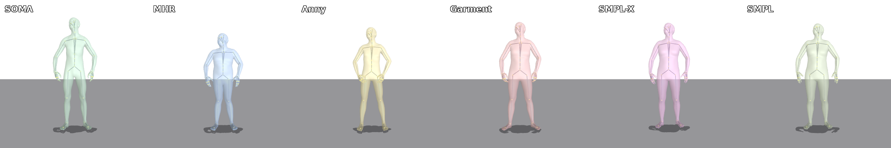
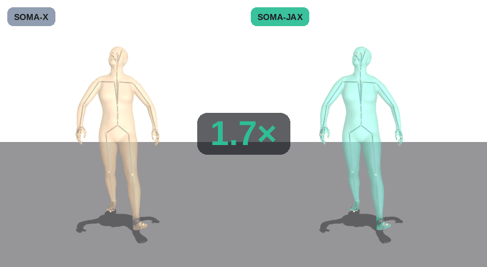

# SOMA-JAX

[](https://opensource.org/licenses/Apache-2.0)
[](https://arxiv.org/abs/2603.16858)
[](https://github.com/NVlabs/SOMA-X)

A JAX port of NVIDIA [SOMA-X](https://github.com/NVlabs/SOMA-X). Same rig, same
pipeline, same numbers — `jax.jit` / `jax.vmap` / `jax.grad` + `equinox` in place
of PyTorch + NVIDIA Warp, so the whole forward is one differentiable, batched,
hardware-portable graph.


<sub>Identical rig and motion, equal wall-clock. The frame counters show what each
pipeline gets through in that time.</sub>

## Overview

- **Faithful.** The forward matches upstream to **3.2e-6 m**, and upstream's
  default 122-joint procedural rig to **0.34–1.16 mm**. Audited module by module
  in [`docs/FAITHFULNESS.md`](docs/FAITHFULNESS.md), which marks what is a port,
  what is an alternative, and what is not ported.
- **Differentiable end to end.** Identity blend → skeleton fit → FK + LBS is a
  single JAX graph: `jit` it, `vmap` thousands of subjects, take gradients
  through it.
- **Runs anywhere JAX runs.** NVIDIA GPU, CPU, TPU — no CUDA-only kernels on the
  faithful path.
- **Every SOMA identity model.** SOMA's own 128-coefficient PCA, MHR, Anny,
  SMPL / SMPL-X / SMPL-H, and GarmentMeasurement.
- **Pose inversion.** SOMA-X's multi-stage solver — inverse-LBS Procrustes refit,
  Lie-algebra Gauss–Newton, optional autograd FK refinement.

## Installation

```bash
git clone --recurse-submodules https://github.com/bozcomlekci/SOMA-JAX.git
cd SOMA-JAX
pip install -e ".[vis]"
python tools/download_assets.py
```

For NVIDIA GPUs install a CUDA build of JAX (`pip install -U "jax[cuda12]"`;
Blackwell cards need CUDA ≥ 12.8). Full setup — GPU, model assets, headless
rendering, and the optional PyTorch + Warp stack for parity checks — is in
[`docs/INSTALL.md`](docs/INSTALL.md).

## Usage

```python
import jax.numpy as jnp
import equinox as eqx
from soma_jax import SOMALayer, SOMAParams

# Builds upstream's rig from the two NVIDIA source files — no PyTorch involved.
layer = SOMALayer.from_upstream_assets()            # 122-joint procedural rig
B, J = 4, len(layer.public_joint_names)             # J == 78

out = eqx.filter_jit(layer)(SOMAParams(
    poses=jnp.zeros((B, J, 3)),                     # axis-angle
    transl=jnp.zeros((B, 3)),
    identity_coeffs=jnp.zeros((B, 128)),
))
out.vertices    # (B, 18056, 3)
out.joints      # (B, 78, 3)
```

Recover pose from a posed mesh:

```python
from soma_jax import SOMAPoseInversion

inv = SOMAPoseInversion(layer)
inv.prepare_identity(identity_coeffs)
result = inv.fit(posed_vertices)    # .rotations, .root_translation, .per_vertex_error
```

## Identity models

Swap the identity source without touching the pose data — every model below is
driven by the same SOMA skeleton and the same motion, and only the body changes:



```python
from soma_jax import create_identity_model, SOMALayer

model = create_identity_model("mhr", soma_data, mhr_model_data)   # or smpl, smplx,
layer = SOMALayer(soma_data, identity_model=model)                # anny, garment…
```

## Performance

Against SOMA-X (PyTorch + Warp) on an RTX 5080, full forward at batch 2048,
matched float32:

| Pipeline | vs SOMA-X | Needs |
|---|---|---|
| **Hybrid** (JAX + one Warp `svd3` kernel) | **1.68× faster** | optional `warp-lang`; approximates upstream's rotation solve |
| **Pure JAX** (the faithful path) | 0.61× — 1.65× slower | nothing beyond JAX |

The pure-JAX path wins below B≈256 and loses above it; the gap is
`jnp.linalg.svd` over many tiny 3×3 matrices. On peak GPU memory SOMA-JAX grows
**5.1× more slowly** with batch and is 3.0× lighter at B=4096, where SOMA-X OOMs
by B=8192.



<sub>Switching the hybrid pipeline to TF32 mid-motion reaches ~2.8× — a JAX-only
deployment mode at ~sub-mm error. float32 stays the like-for-like comparison.</sub>

Method, fairness checks and the full precision discussion:
[`benchmarks/README.md`](benchmarks/README.md).

## Documentation

| | |
|---|---|
| [`docs/DESCRIPTION.md`](docs/DESCRIPTION.md) | what is implemented, the API surface, tooling and conversion scripts |
| [`docs/FAITHFULNESS.md`](docs/FAITHFULNESS.md) | module-by-module parity audit against SOMA-X |
| [`docs/INSTALL.md`](docs/INSTALL.md) | GPU setup, model assets, headless rendering |
| [`benchmarks/README.md`](benchmarks/README.md) | runtime and memory study vs SOMA-X |

## License

**[Apache-2.0](LICENSE)** — the same licence as upstream
[SOMA-X](https://github.com/NVlabs/SOMA-X), which this port derives from.
Attribution and the summary of changes are in [`NOTICE`](NOTICE).

**Model assets are not covered by it.** No weights, rigs or PCA bases ship in
this repository; they are fetched separately and carry their own terms, several
research-only. See [`NOTICE`](NOTICE) for the list and links.

## Citation

If you use SOMA-JAX, please cite the original SOMA-X paper:

```bibtex
@article{soma2026,
  title={SOMA: Unifying Parametric Human Body Models},
  author={Jun Saito and Jiefeng Li and Michael de Ruyter and Miguel Guerrero and Edy Lim and Ehsan Hassani and Roger Blanco Ribera and Hyejin Moon and Magdalena Dadela and Marco Di Lucca and Qiao Wang and Xueting Li and Jan Kautz and Simon Yuen and Umar Iqbal},
  eprint={2603.16858},
  archivePrefix={arXiv},
  year={2026},
  url={https://arxiv.org/abs/2603.16858},
}
```
