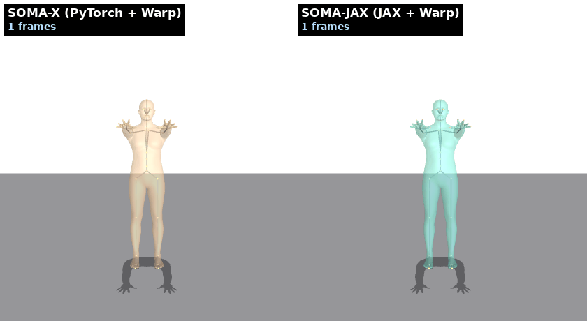
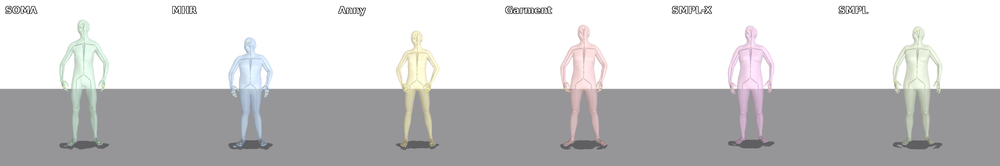

# SOMA-JAX

[](https://opensource.org/licenses/Apache-2.0)
[](https://arxiv.org/abs/2603.16858)
[](https://github.com/NVlabs/SOMA-X)

A JAX port of NVIDIA [SOMA-X](https://github.com/NVlabs/SOMA-X). Same rig, same
pipeline, same numbers — `jax.jit` / `jax.vmap` / `jax.grad` + `equinox` in place
of PyTorch + NVIDIA Warp, so the whole forward is one differentiable, batched,
hardware-portable graph.



<sub>SOMA-X's own example animation on the identical rig, at equal wall-clock: the
frame counters show what each pipeline gets through in that time. The SOMA-JAX
column is the JAX + Warp hybrid (2.6× at batch 2048); the faithful pure-JAX path
is 2.0×.</sub>

## Overview

- **Faithful.** A port of SOMA-X v0.3.3: the body forward matches upstream at
  every LOD, on the default 110-joint procedural rig and the legacy one, with
  pose correctives, to **≤ 3.1 µm**. Audited module by module in
  [`docs/FAITHFULNESS.md`](docs/FAITHFULNESS.md), which also lists what differs
  by design, which upstream defects are not reproduced, and what SOMA-JAX adds.
- **Differentiable end to end.** Identity blend → skeleton fit → FK + LBS is a
  single JAX graph: `jit` it, `vmap` thousands of subjects, take gradients
  through it.
- **Runs anywhere JAX runs.** NVIDIA GPU, CPU, TPU — no CUDA-only kernels on the
  faithful path.
- **Every SOMA identity model.** SOMA's own 128-coefficient PCA, MHR, Anny,
  SMPL / SMPL-X / SMPL-H, and GarmentMeasurement.
- **Pose inversion.** SOMA-X's multi-stage solver — inverse-LBS Procrustes refit,
  Lie-algebra Gauss–Newton, optional autograd FK refinement — and its native-MHR
  inverter, plus RTS pose smoothing and the SOMA Hand / MANO layers.

## Installation

```bash
git lfs install                     # SOMA-X's assets are git-lfs objects
git clone --recurse-submodules https://github.com/bozcomlekci/SOMA-JAX.git
cd SOMA-JAX
pip install -e ".[vis]"
```

The model assets come with the `third_party/SOMA-X` submodule;
`python tools/download_assets.py --check` reports anything missing.

For NVIDIA GPUs install a CUDA build of JAX (`pip install -U "jax[cuda12]"`;
Blackwell cards need CUDA ≥ 12.8). Full setup — GPU, model assets, headless
rendering, and the optional PyTorch + Warp stack for parity checks — is in
[`docs/INSTALL.md`](docs/INSTALL.md).

## Usage

```python
import jax.numpy as jnp
import equinox as eqx
from soma_jax import SOMALayer, SOMAParams

# Builds upstream's rig from the two NVIDIA source files — no PyTorch involved.
layer = SOMALayer.from_upstream_assets()            # 110-joint procedural rig
B, J = 4, len(layer.public_joint_names)             # J == 78

out = eqx.filter_jit(layer)(SOMAParams(
    poses=jnp.zeros((B, J, 3)),                     # axis-angle
    transl=jnp.zeros((B, 3)),
    identity_coeffs=jnp.zeros((B, 128)),
))
out.vertices    # (B, 18056, 3)
out.joints      # (B, 78, 3)
```

Recover pose from a posed mesh:

```python
from soma_jax import SOMAPoseInversion

inv = SOMAPoseInversion(layer)
inv.prepare_identity(identity_coeffs)
result = inv.fit(posed_vertices)    # .rotations, .root_translation, .per_vertex_error
```

## Identity models

Swap the identity source without touching the pose data — every model below is
driven by the same SOMA skeleton and the same motion, and only the body changes:



```python
from soma_jax import SOMALayer

layer = SOMALayer.from_upstream_assets(identity_model_type="mhr")   # or "anny",
# "garment", "soma"; SMPL-family backends also take the licensed model file:
layer = SOMALayer.from_upstream_assets(
    identity_model_type="smplx", identity_model_kwargs={"model_path": "SMPLX_NEUTRAL.npz"})
```

## Performance

Against SOMA-X (PyTorch + Warp) on an RTX 5080: the full forward (identity
blend → skeleton fit → FK + LBS) on the same rig, matched float32.

| Pipeline | B=1 | B=128 | B=2048 | Needs |
|---|---:|---:|---:|---|
| **Pure JAX** (the faithful path) | 5.6× faster | 3.6× | **2.0×** | nothing beyond JAX |
| **Hybrid** (JAX + one Warp `svd3` kernel) | 24× | 6.0× | **2.65×** | optional `warp-lang`; approximates upstream's rotation solve |

The pure-JAX path reproduces SOMA-X's posed meshes to 0.0027 mm; the hybrid's
plain-Kabsch rotation step departs from upstream's on ill-conditioned joints
(0.69 mm max). On peak GPU memory SOMA-JAX starts slightly heavier (1.08 vs
1.01 GiB at B=1), crosses SOMA-X between B=32 and B=64, and grows 3.5× more
slowly with batch: at B=4096 it needs 3.58 GiB to SOMA-X's 9.88, and SOMA-X
runs out of the 16 GB card at B=8192.


<sub>Switching the hybrid to TF32 mid-motion takes it from 2.6× to 2.8× — a
JAX-only mode at sub-millimetre error (mean 0.015 mm). float32 stays the
like-for-like comparison.</sub>

Method, fairness checks and the full precision discussion:
[`benchmarks/README.md`](benchmarks/README.md).

## Documentation

| | |
|---|---|
| [`docs/DESCRIPTION.md`](docs/DESCRIPTION.md) | what is implemented, the API surface, tooling and conversion scripts |
| [`docs/FAITHFULNESS.md`](docs/FAITHFULNESS.md) | module-by-module parity audit against SOMA-X |
| [`docs/INSTALL.md`](docs/INSTALL.md) | GPU setup, model assets, headless rendering |
| [`benchmarks/README.md`](benchmarks/README.md) | runtime and memory study vs SOMA-X |

## License

**[Apache-2.0](LICENSE)** — the same licence as upstream
[SOMA-X](https://github.com/NVlabs/SOMA-X), which this port derives from.
Attribution and the summary of changes are in [`NOTICE`](NOTICE).

**Model assets are not covered by it.** No weights, rigs or PCA bases ship in
this repository; they are fetched separately and carry their own terms, several
research-only. See [`NOTICE`](NOTICE) for the list and links.

## Citation

If you use SOMA-JAX, please cite the original SOMA-X paper:

```bibtex
@article{soma2026,
  title={SOMA: Unifying Parametric Human Body Models},
  author={Jun Saito and Jiefeng Li and Michael de Ruyter and Miguel Guerrero and Edy Lim and Ehsan Hassani and Roger Blanco Ribera and Hyejin Moon and Magdalena Dadela and Marco Di Lucca and Qiao Wang and Xueting Li and Jan Kautz and Simon Yuen and Umar Iqbal},
  eprint={2603.16858},
  archivePrefix={arXiv},
  year={2026},
  url={https://arxiv.org/abs/2603.16858},
}
```
