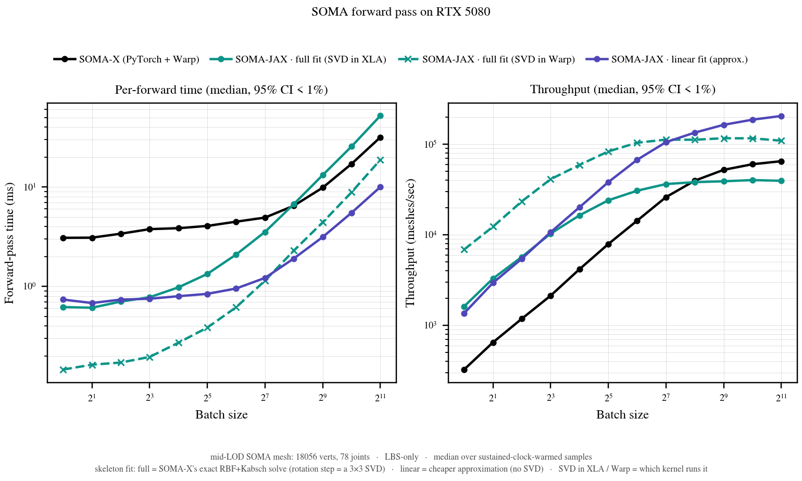
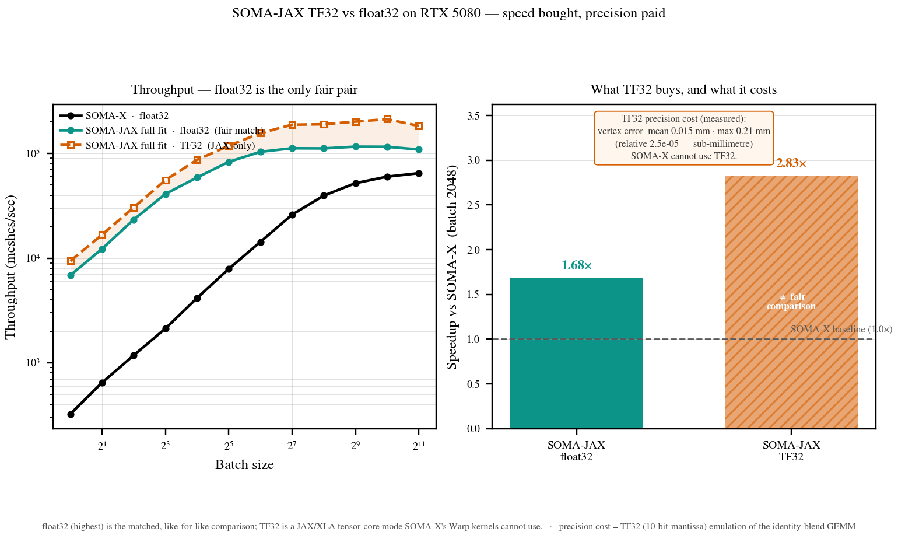
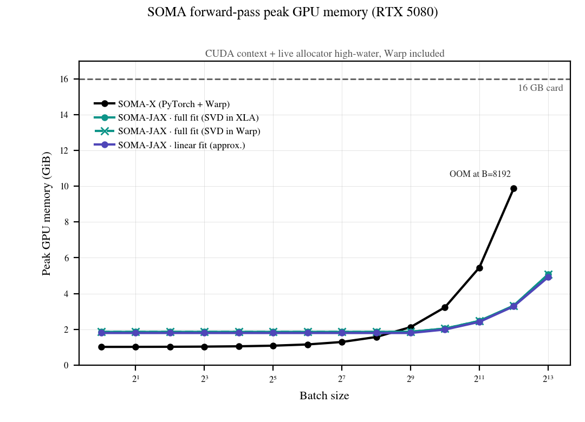

# SOMA-JAX vs SOMA-X — forward-pass benchmarks

Reproducing (and extending) the SOMA paper's **Table 4 (Runtime performance)**
([arXiv:2603.16858](https://arxiv.org/abs/2603.16858) — the paper is not
distributed with this repo) on a single
NVIDIA **RTX 5080 (16 GB)** in the `body` conda env. Two experiments:

* **Runtime** — forward-pass time & throughput vs batch size.
* **Memory** — peak GPU memory vs batch size.

## Folder layout

```
benchmarks/
  README.md
  bench_forward_pass.py   verify_fairness.py   run_runtime.sh   plot_runtimes.py   # runtime
  bench_memory.py                              run_memory.sh    plot_memory.py     # memory
                                                                plot_tf32.py       # precision
                                              plot_procedural_gap.py               # rig study
  results/     runtime.json  runtime_tf32.json  memory.jsonl  tf32_precision.json   # data
  figures/     runtimes.{png,pdf}  memory.{png,pdf}  tf32.{png,pdf}
               procedural_rig_gap.{png,pdf}
```

**Blackwell (RTX 50-series) needs CUDA >= 12.8.** JAX's `nvidia-*-cu12` wheels are
pinned only as `>=`, so an older environment can leave you on cuBLAS 12.4, which
carries no `sm_120` kernels; it fails with `INTERNAL: the library was not
initialized`, sometimes only for particular shapes. See
[`docs/INSTALL.md`](../docs/INSTALL.md) for the one-line fix. Verified working on
an RTX 5080 with the 12.9 wheels: all four pipelines benchmark, and the memory
figures below reproduce (`fair` at B=64 lands on 1.86 GiB exactly).

Run:

```bash
# runtime (torch and JAX go in separate subprocesses — different CUDA stacks)
BATCHES="1 2 4 8 16 32 64 128 256 512 1024 2048" bash benchmarks/run_runtime.sh
python benchmarks/plot_runtimes.py

# memory (one FRESH subprocess per (method, batch))
bash benchmarks/run_memory.sh
python benchmarks/plot_memory.py

# what upstream's 122-joint procedural rig changes (upstream vs upstream, CPU)
python benchmarks/plot_procedural_gap.py
```

## Numerical precision — one convention

**Every headline number on this page, runtime *and* memory, is true float32 on
both sides.** Storage is float32 throughout; the only variable is whether a
float32 *matmul* may run on TF32 tensor cores, and both benchmark scripts now
pin that explicitly on both sides rather than inheriting library defaults:

| Side | Setting | Effect |
|---|---|---|
| SOMA-X (torch + Warp) | `torch.backends.cuda.matmul.allow_tf32 = False` | true float32 matmuls |
| SOMA-X (torch + Warp) | `torch.backends.cudnn.allow_tf32 = False` | no-op — cuDNN is unused by LBS/FK |
| SOMA-JAX (XLA) | `jax_default_matmul_precision = "highest"` | true float32 matmuls |

Leaving these implicit is a trap: JAX's `default_matmul_precision` is `None`,
which lets XLA pick **TF32** on Ampere and newer, while torch's `allow_tf32` is
already `False` — so the *unset* comparison is JAX-TF32 against
SOMA-X-float32, which flatters SOMA-JAX. The runtime benchmark always pinned
this ([fairness audit](#fairness-audit) point 1); the **memory** benchmark did
not, and its earlier numbers were produced with JAX on the TF32-capable default.
It now uses the same `--matmul-precision highest` default. Both scripts stamp
the convention into their output (a `precision` field, present on every row of
`memory.jsonl`). The committed `runtime.json` predates that stamping, so its
provenance rests on the settings documented here rather than on the artifact
itself; regenerating it with the current script will add the field.

TF32 is measured **separately and never mixed into the float32 comparison** —
see [Precision — float32 is the fair headline](#tf32-section). The teaser GIF's
"~2.8×" is that JAX-only TF32 mode and is labelled as such; the fair
like-for-like figure is the float32 "~1.7×".

## The four setups

The three SOMA-JAX rows differ **only** in the per-identity *skeleton fit*
(mapping a body shape to its posed joints); all four share the same FK +
top-8-sparse LBS, the same dimensions, and the same identity/pose inputs.

| Setup | Skeleton fit | Framework |
|---|---|---|
| **SOMA-X (PyTorch + Warp)** | exact: RBF joint regression + 2-stage Kabsch (rotation step = Newton–Schulz on a gauge-regularized covariance, upstream's `auto`) | torch + NVIDIA Warp kernels (the original) |
| **SOMA-JAX · full fit (SVD in XLA)** | *same algorithm* (`rotation_method="auto"`), JAX port | JAX / XLA |
| **SOMA-JAX · full fit (SVD in Warp)** | same covariance build; the rotation step runs a Warp `svd3` kernel inside the JAX graph (XLA FFI) — plain SVD Procrustes, see the caveat below | JAX + one Warp kernel |
| **SOMA-JAX · linear fit (approx.)** | approximate: a precomputed linear `J_regressor` (no rotation solve, no SVD) | JAX / XLA |

<a name="rig-caveat"></a>
**Caveat — the two timed sides do not use the identical rig.** The SOMA-X side
builds upstream's `SOMALayer`, which merges `SOMA_template_rig.usda` over the
NPZ rig (`third_party/SOMA-X/soma/soma.py`); the SOMA-JAX side loads the raw
`assets/third_party/SOMA_neutral.npz` arrays directly (`bench_forward_pass.py`,
`verify_fairness.py`). Those rigs differ in 45,672 skinning-weight entries and up
to 0.1275 cm of bind translation (see [`docs/FAITHFULNESS.md`](../docs/FAITHFULNESS.md)).
For a **runtime** benchmark this is immaterial — identical shapes, identical
sparsity, identical FLOP count, so the timings stand — but it means the two
sides are not producing numerically comparable meshes here, and
`verify_fairness.py` accordingly asserts agreement *between the two JAX
variants*, not against SOMA-X. End-to-end numerical parity against upstream is
the job of `tests/test_layer_parity.py`, which does use the merged rig and
agrees to 3.2e-6 m.

**SVD-in-XLA is the faithful row.** It runs upstream's rotation method
(`"auto"` — Newton–Schulz on a gauge-regularized covariance) and matches
upstream `align_vectors` to ≤1e-6 across 4096 problems including 2048
rank-deficient ones. The Warp `svd3` kernel implements plain SVD Procrustes
(`method="kabsch"`) instead: identical on well-conditioned covariances,
different on ill-conditioned ones — upstream's own Warp module ships a
dedicated `auto` kernel that SOMA-JAX has not ported. End-to-end on this rig
the two posed meshes agree to **210 µm max / 0.94 µm mean**, so SVD-in-Warp is
a fast *approximation* of SVD-in-XLA, not the same algorithm. "Linear fit" is a
cheaper approximation again.

<a name="fairness-audit"></a>
## Fairness audit

Four asymmetries were found and fixed; all numbers below are precision- and
work-matched:

1. **Matmul precision** (was favouring JAX ~1.6×): XLA defaults float32 matmuls
   to TF32 on Ampere+, while SOMA-X runs full float32 (torch `allow_tf32=False`;
   Warp scalar kernels). Both sides now run full float32
   (`jax_default_matmul_precision="highest"`).
2. **Skel. scope**: SOMA-X's `prepare_identity` includes the identity blend +
   rebind precompute; the JAX mirror computes all four outputs.
3. **Output materialization**: the JAX forward returns the full `(B, V, 3)`
   vertex buffer (no scalar reduction XLA could fuse away).
4. **LBS sparsity**: both skin with top-8 sparse weights (`topk_skinning(W, 8)`;
   SOMA-X's Warp default is K=8).

Cross-pipeline agreement, no-constant-folding, and SVD-non-uniqueness are
checked by [`verify_fairness.py`](verify_fairness.py) (all assertions pass; the
JAX-SVD and Warp-SVD posed meshes agree to 210 µm max / 0.94 µm mean).

## Timing methodology (low variance)

The RTX 5080 idles at ~810 MHz and boosts to ~3090 MHz, and clocks can't be
locked without root — that ramp is the only real source of run-to-run spread.
`bench_forward_pass._timed_samples` handles it: a **wall-clock warmup** pins the
clocks at boost, then each sample times several forwards back-to-back with one
device sync (`inner`/`outer` self-size per batch), and the reported value is the
**median**. The uncertainty of that median is its standard error
(≈ 1.25·std/√n), which is **< 1% everywhere** (see the ±SE column) — so the
figures show median lines with a hairline band, not fuzzy error envelopes. (The
larger per-call spread is GPU clock jitter — a property of a single call, not
measurement error.)

## Paper Table 4 (excerpt — values verbatim, A100)

| Mode | Batch | Skel. (ms) | Total (ms) | Meshes/sec |
|---|---:|---:|---:|---:|
| Warp (GPU) | 1 | 0.8 | 2.1 | 476 |
| Warp (GPU) | 8 | 0.9 | 3.4 | 2 353 |
| Warp (GPU) | 32 | 1.1 | 6.8 | 4 706 |
| Warp (GPU) | 128 | 1.4 | 18.2 | 7 033 |
| PyTorch (CPU) | 1 | 3.2 | 12.1 | 83 |

## Runtime on RTX 5080 (median full-forward, matched float32)

`± X%` is the relative standard error of the median (measurement uncertainty of
the reported number).

#### SOMA-X (PyTorch + Warp)
| Batch | Median (ms) | ±SE | Meshes/sec |
|---:|---|---|---:|
|     1 | 3.079 | ±0.40% |        325 |
|     8 | 3.764 | ±0.50% |      2,125 |
|    32 | 4.056 | ±0.72% |      7,890 |
|   128 | 4.918 | ±0.67% |     26,026 |
|   256 | 6.472 | ±0.46% |     39,556 |
|   512 | 9.836 | ±0.61% |     52,053 |
|  1024 | 17.048 | ±0.31% |     60,067 |
|  2048 | 31.580 | ±0.24% |     64,851 |

#### SOMA-JAX · full fit (SVD in Warp) — the full-fit pipeline to use at scale
| Batch | Median (ms) | ±SE | Meshes/sec |
|---:|---|---|---:|
|     1 | 0.146 | ±0.37% |      6,864 |
|     8 | 0.195 | ±0.32% |     41,017 |
|    32 | 0.385 | ±0.20% |     83,138 |
|   128 | 1.141 | ±0.35% |    112,199 |
|   256 | 2.288 | ±0.35% |    111,866 |
|   512 | 4.403 | ±0.23% |    116,280 |
|  1024 | 8.832 | ±0.18% |    115,942 |
|  2048 | 18.758 | ±0.09% |    109,182 |

#### SOMA-JAX · full fit (SVD in XLA)
| Batch | Median (ms) | ±SE | Meshes/sec |
|---:|---|---|---:|
|     1 | 0.619 | ±0.32% |      1,615 |
|     8 | 0.777 | ±0.33% |     10,294 |
|    32 | 1.333 | ±0.66% |     24,009 |
|   128 | 3.528 | ±0.45% |     36,279 |
|   256 | 6.727 | ±0.65% |     38,058 |
|   512 | 13.152 | ±0.33% |     38,930 |
|  1024 | 25.519 | ±0.11% |     40,127 |
|  2048 | 51.998 | ±0.08% |     39,387 |

#### SOMA-JAX · linear fit (approximate — different algorithm)
| Batch | Median (ms) | ±SE | Meshes/sec |
|---:|---|---|---:|
|     1 | 0.737 | ±0.33% |      1,358 |
|     8 | 0.751 | ±0.27% |     10,659 |
|    32 | 0.841 | ±0.20% |     38,067 |
|   128 | 1.216 | ±0.26% |    105,281 |
|   256 | 1.908 | ±0.25% |    134,193 |
|   512 | 3.131 | ±0.18% |    163,533 |
|  1024 | 5.494 | ±0.20% |    186,400 |
|  2048 | 10.000 | ±0.35% |    204,800 |


([PDF](figures/runtimes.pdf))

### Runtime conclusions

* **Which row the headline belongs to.** The "SOMA-JAX is faster" number is the
  **Warp-SVD** row — an *optional* pipeline needing `warp-lang`, whose rotation
  step approximates upstream's `auto` solve (see [the four setups](#the-four-setups)).
  The **faithful pure-JAX row is slower than SOMA-X at large batch.** Both, at
  B=2048: Warp-SVD **1.68×** faster (18.8 vs 31.6 ms); XLA-SVD **0.61×**, i.e.
  1.65× slower (52.0 ms). Quote whichever you mean, but do not quote the first
  as a property of the pure-JAX port.
* **The Warp-SVD pipeline beats SOMA-X at every batch it runs:** ~21× at B=1,
  7.3× at B=64, 2.8× at B=256, 1.9× at B=1024, **1.7× at B=2048.** The
  small-batch figures are sustained throughput with launch overhead amortized
  (SOMA-X's Warp path pays a large fixed per-call cost); the honest
  **compute-bound advantage is the ~1.7–1.9× at B≥1024**. Peak ~116 k
  meshes/sec (B=512) vs SOMA-X's 65 k (B=2048).
* **The XLA-SVD full-fit pipeline wins up to B≈256, then loses** (crossover at
  B≈256, 0.6× at B=2048) — the gap is entirely `jnp.linalg.svd` over `B·78`
  tiny matrices (compare the two full-fit rows: 52.0 ms vs 18.8 ms at B=2048).
  This is why the Warp-SVD variant is the one to use at scale, and why the
  faithful path's honest standing at scale is *slower than SOMA-X*.
* **The skinning path is never the bottleneck.** The linear approximation on
  the same FK + sparse-LBS machinery reaches **205 k meshes/sec** at B=2048.

<a name="tf32-section"></a>
### Precision — float32 is the fair headline; TF32 is a JAX-only extra

Every table above is **matched full float32** (fairness point 1), which is the
*only* like-for-like comparison — because **SOMA-X cannot use TF32.** Its heavy
compute is Warp scalar-float32 kernels (FK, LBS, the Kabsch 3×3 SVD) plus a
*sparse* RBF matmul; none run on the TF32 tensor-core path. Turning on
`torch.backends.cuda.matmul.allow_tf32` changed SOMA-X's B=2048 forward by
nothing measurable (30.18 → 30.64 ms).

TF32 is a lever only the JAX/XLA side has: the vectorized covariance build is
*large dense GEMMs* (`B·V·J·9` FLOPs), which XLA runs on tensor cores. Measured
JAX-only with `--matmul-precision default` (**NOT comparable to SOMA-X's
float32** — it is lower-precision arithmetic SOMA-X has no equivalent for):


([PDF](figures/tf32.pdf))

<sub>Left: only the two **float32** curves are a like-for-like pair; the TF32
curve is set apart (JAX-only, lower precision). Right: the fair float32 speedup
(1.68×) vs the TF32 speedup (2.83×, flagged **not comparable**), with the
measured TF32 precision cost — mean **0.015 mm** / max **0.21 mm** vertex error
(relative ≈ 2.5e-5, sub-millimetre). SOMA-X cannot use TF32.</sub>

Animated companion (`assets/media/soma_jax_tf32_teaser.gif`, via
`tools/compare_render/render_tf32_teaser.py`) — each column's panel is a progress
bar whose length reads the speedup, and the body switches float32 → TF32 in the
middle of the motion: the SOMA-JAX bar leaps **1.7× → 2.8×** the SOMA-X bar and
its animation gets smoother while SOMA-X stays choppy (both ratios come from
`results/runtime.json` and `runtime_tf32.json` at B=2048, so the badge, this page
and the table below cannot drift apart):


**SOMA-JAX · full fit (SVD in Warp)** — the pipeline to use at scale:

| Batch | float32 (m/s) | TF32 (m/s) | TF32 vs its own float32 |
|---:|---:|---:|---:|
|  128 | 112,199 | 188,465 | 1.68× |
|  512 | 116,280 | 201,708 | 1.73× |
| 1024 | 115,942 | 212,648 | 1.83× |
| 2048 | 109,182 | 183,537 | 1.68× |

The XLA-SVD and linear paths gain far less from TF32 (~1.1× and ~1.0–1.5×),
because their bottleneck is the SVD / a single fit matmul, not the covariance
GEMMs — confirming TF32 only accelerates the large tensor-core-eligible matmuls.

**How to read it.** TF32 is a genuine ~1.7× *deployment* speedup available to
SOMA-JAX at a **measured sub-millimetre cost** — mean 0.015 mm / max 0.21 mm
vertex error, relative ≈ 2.5e-5 (from a 10-bit-mantissa emulation of the
identity-blend GEMM, the largest matmul in the forward; see
`results/tf32_precision.json`) — an advantage SOMA-X structurally cannot match.
But it is a **precision trade-off, not a like-for-like speed number**, so it is
never put head-to-head with SOMA-X. (For reference only, and *not a fair claim*:
hybrid TF32 would read ~2.8× vs SOMA-X's float32 at B=2048, vs the fair **1.7×
at float32**.) Reproduce:

```bash
bash benchmarks/run_runtime.sh                              # float32 (fair, the headline)
# TF32, JAX-only (do not compare to SOMA-X):
python benchmarks/bench_forward_pass.py --skip-soma-x --matmul-precision default \
    --batches 1 8 32 128 256 512 1024 2048 \
    --output benchmarks/results/runtime_tf32.json
python benchmarks/plot_tf32.py                              # -> figures/tf32.{png,pdf}
```

## Memory on RTX 5080 (peak GPU memory)

**One metric: `peak_mib`** — the CUDA context plus the high-water mark of the
**live device bytes the process actually demands**, with NVIDIA Warp's
allocations counted on both sides:

```
peak_mib = context_mib + max over time of (framework_live + warp_live)
```

Values in **GiB** (1 GiB = 1024 MiB). One fresh subprocess per point.

| Batch | SOMA-X | full fit (XLA) | full fit (Warp) | linear |
|---:|---|---|---|---|
|    1 | **1.01** | 1.86 | 1.86 | 1.79 |
|  256 | **1.57** | 1.86 | 1.86 | 1.79 |
|  512 | 2.12 | 1.86 | 1.86 | **1.79** |
| 1024 | 3.23 | 2.04 | 2.04 | **1.99** |
| 2048 | 5.45 | 2.47 | 2.47 | **2.41** |
| 4096 | 9.88 | 3.32 | 3.31 | **3.28** |
| 8192 | **OOM** | 5.06 | 5.06 | **4.91** |

 ([PDF](figures/memory.pdf))

### Memory conclusions

* **SOMA-X starts smaller and ends much larger.** It carries the lighter fixed
  baseline (1.01 vs 1.86 GiB) and wins below the crossover, which the measured
  points bracket **between B=256 and B=512** (at 256 SOMA-X is 294 MiB lighter;
  at 512 it is 266 MiB heavier). Above it SOMA-JAX pulls away — **3.0× lighter
  at B=4096** (3.32 vs 9.88 GiB) — and SOMA-X **OOMs at B=8192** on the 16 GB
  card while every JAX pipeline still fits with room to spare.
* **The difference at scale is marginal cost per sample, not the baseline.**
  Least-squares over B≥1024: **2.215 MiB/sample** for SOMA-X versus **0.432**
  for SOMA-JAX — **5.1× less**, against a 0.207 MiB/sample floor set by the
  output buffer alone (18056 verts × 3 × float32). SOMA-JAX is therefore within
  2.1× of the theoretical minimum; SOMA-X is 10.7× above it.
* **Why.** XLA does whole-graph buffer assignment — liveness analysis, fusion of
  elementwise chains, in-place reuse — so most LBS/FK temporaries are never
  materialised. Eager PyTorch allocates a fresh tensor per op and frees it only
  when its refcount drops, leaving many `(B, V, 3)` intermediates simultaneously
  live; SOMA-X's Warp kernels add their own `(B, V, 3)` output buffer on top
  (1.43 GiB at B=2048, measured).
* **The two full-fit pipelines are memory-identical** (within 18 MiB at every
  point). The Warp `svd3` kernel receives XLA's buffers through the FFI and
  allocates nothing of its own — measured `warp_peak_mib = 0` for the hybrid
  row — so its large *speed* win at scale is free, memory-wise.
* **`linear` is barely lighter than full fit, and that is a regression.** It
  saves only ~64 MiB despite skipping the entire skeleton fit, because
  `SOMALayer.__init__` builds the `SkeletonTransfer` eagerly and the linear path
  pays for it anyway. See [the baseline breakdown](#memory-baseline).

<a name="memory-methodology"></a>
### How this is measured (and why not nvidia-smi)

Nothing here polls. Every byte is counted where it is allocated:

| Source | Counter | Character |
|---|---|---|
| XLA | `memory_stats()["bytes_in_use"]` / `["peak_bytes_in_use"]` | exact, maintained on every alloc/free |
| PyTorch | `torch.cuda.memory_allocated()` / `max_memory_allocated()` | exact, same |
| NVIDIA Warp | counting allocator installed via `wp.set_device_allocator` | exact, wraps and delegates to the allocator Warp was already using |
| CUDA context | one `cuMemGetInfo` read before model data loads | fixed, does not scale with batch |

**Warp is the part that makes SOMA-X's column honest.** SOMA-X runs with Warp's
memory pool disabled (`third_party/SOMA-X/soma/_warp_utils.py`), so its Warp
buffers come from plain `cudaMalloc` and are invisible to every `torch.cuda`
counter — and they scale with batch, reaching **1.43 GiB at B=2048** and
**2.87 GiB at B=4096**. Ignoring them understates SOMA-X's slope as 1.52
instead of 2.215 MiB/sample. `bench_memory.py` therefore wraps Warp's allocator
with a counter that *delegates* to the allocator already in use: same mempool
setting, same underlying calls, no policy change — it only records sizes. This
is instrumentation, not modification; SOMA-X still runs exactly as published.

**Why not `nvidia-smi`.** It reports what a process has *reserved* from the
driver, not what it needs. Both frameworks pool, and their pools differ sharply
in granularity — torch's caching allocator uses fine 2 MiB blocks that track
demand closely, while XLA's BFC pool grows in large power-of-two blocks it never
releases. Reading reservation therefore charged SOMA-JAX for pool policy rather
than for memory it used, produced a staircase curve that had to be explained
away, and inflated the apparent crossover. It also has to be *sampled*, so it
both jitters and can miss short-lived peaks. Earlier revisions of this page used
it; the numbers above replace those. (Disabling either pool was not an option —
that would stop measuring the pipeline a real user gets.) The one environment
override is `XLA_PYTHON_CLIENT_PREALLOCATE=false`: JAX's default grabs 75% of
the card up front, which would make every reading identical.

**Combining two allocators.** `peak(a + b) ≠ peak(a) + peak(b)`, so the
combined high-water is sampled at every Warp alloc/free event (reading the
framework's live-byte counter at that instant), once per iteration, and folded
against the framework's own per-iteration peak so a torch/XLA-only maximum can
never be missed. Each row also carries `peak_upper_mib`, the pessimistic
`framework_peak + warp_peak` bound. The two agree to **≤0.91% on SOMA-X and
exactly on every JAX row**, so the reported figure is tightly determined rather
than an estimate. Every row additionally records `context_mib`,
`framework_peak_mib` and `warp_peak_mib` so any total can be decomposed.

<a name="memory-baseline"></a>
### Why SOMA-JAX has the larger fixed baseline

At B=1, decomposed from the committed rows:

| Component | SOMA-X | SOMA-JAX (full fit) |
|---|---:|---:|
| CUDA context + framework runtime | 470 MiB | 434 MiB |
| Constant model data + compiled kernel | 569 MiB | 1466 MiB |
| **Total** | **1039 MiB** | **1900 MiB** |

The gap is almost entirely constant model data, and **489 MiB of it is
avoidable**: `SkeletonTransfer._precompute_regressors` builds a per-joint
`RadialBasisFunction` — each holding an LU factorisation of its support-vertex
system, the three largest 134 MiB apiece — *and* a dense `(J, V)`
`_sparse_rbf_matrix`. With `use_sparse_rbf_matrix=True` (the default) only the
5.4 MiB matrix is used at inference, but the per-joint objects are retained and
never released.

`SOMALayer.__init__` also builds the `SkeletonTransfer` **eagerly**, so
`skeleton_fit="linear"` — which never touches it — still pays the full cost;
that is why `linear` saves only ~64 MiB over full fit. Freeing the per-joint
regressors once the matrix exists, and constructing the transfer lazily, would
cut the SOMA-JAX baseline by roughly a third and move the crossover with SOMA-X
to a smaller batch. Neither is done here: this page measures the code as it
stands.


## Fairness verification

[`verify_fairness.py`](verify_fairness.py) (run on a free GPU) confirms the
timed JAX code does real, input-dependent work and that the two JAX variants
agree — all assertions pass. It does **not** assert numerical agreement with
SOMA-X; the rigs differ (see the [rig caveat](#rig-caveat)), and upstream
parity is `tests/test_layer_parity.py`'s job.

* **No constant-folding:** re-timing with random non-zero inputs gives the same
  latency (ratio 1.00) → the work is genuinely input-dependent.
* **Real output:** posed vertices finite, spatial std ≈ 0.42 m, change > 1 m
  with the input.
* **Cross-pipeline agreement:** XLA-SVD vs Warp-SVD posed meshes agree to
  210 µm max / 0.94 µm mean (matched float32).
* **SVD non-uniqueness is not error:** against the algorithm the Warp kernel
  actually implements (`rotation_from_covariance(method="kabsch")`) only
  43 / 4096 synthetic problems diverge, and there both are valid SO(3) with the
  same Kabsch residual (relative gap ≤ 1.4e-3).
* **Reported, not asserted — the `auto` gap.** The pipelines' *default*
  rotation method is `"auto"` (Newton–Schulz on a gauge-regularized
  covariance), and on ill-conditioned covariances that is a genuinely different
  rotation from Procrustes: 1797 / 4096 diverge, and the Warp/Procrustes answer
  is the lower-residual one in 1668 of them. **This is upstream SOMA-X's own
  split** — upstream `align_vectors(method="auto")` vs `method="kabsch")`
  differs on 1776 / 4096 of the same problems, and SOMA-JAX reproduces
  upstream's `auto` to ≤1e-6. It is why the Warp-SVD row is an approximation of
  the XLA-SVD row rather than the same algorithm.

## Caveats

* RTX 5080 vs the paper's A100 — absolute numbers aren't comparable across GPU
  generations; the within-GPU comparisons are.
* Both sides: correctives disabled (LBS-only), SOMA-native identity backend,
  matched full float32, `CUDA_VISIBLE_DEVICES=0`.
* Small-batch runtime is *sustained* throughput (host/launch overhead
  amortized), which is the right metric for a throughput benchmark but is not
  cold single-call latency.

## Files

| File | Purpose |
|---|---|
| `bench_forward_pass.py` | runtime benchmark (all 4 setups; median + SE; writes `results/runtime.json`) |
| `run_runtime.sh` | runs torch / JAX subprocesses and merges into `results/runtime.json` |
| `plot_runtimes.py` | two-panel runtime figure → `figures/runtimes.{png,pdf}` |
| `plot_tf32.py` | TF32-vs-float32 trade figure (speed + measured precision cost) → `figures/tf32.{png,pdf}` |
| `verify_fairness.py` | fairness checks (shared `_build_fair_pipeline`) |
| `bench_memory.py` | memory benchmark (context + live high-water incl. Warp; one fresh subprocess per point) |
| `run_memory.sh` | memory sweep → `results/memory.jsonl` |
| `plot_memory.py` | single-panel memory figure (GiB) → `figures/memory.{png,pdf}` |
