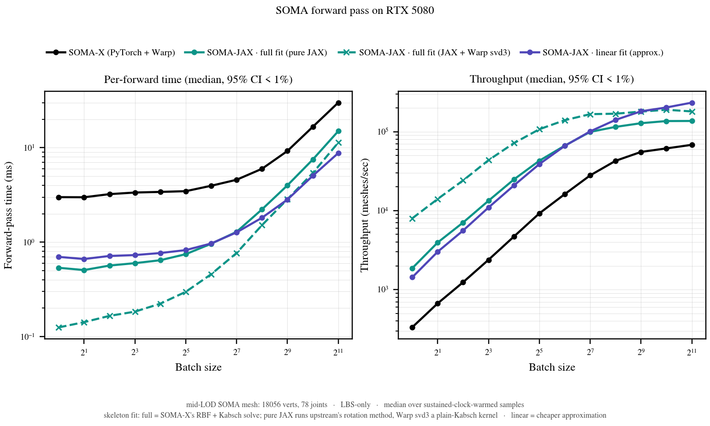
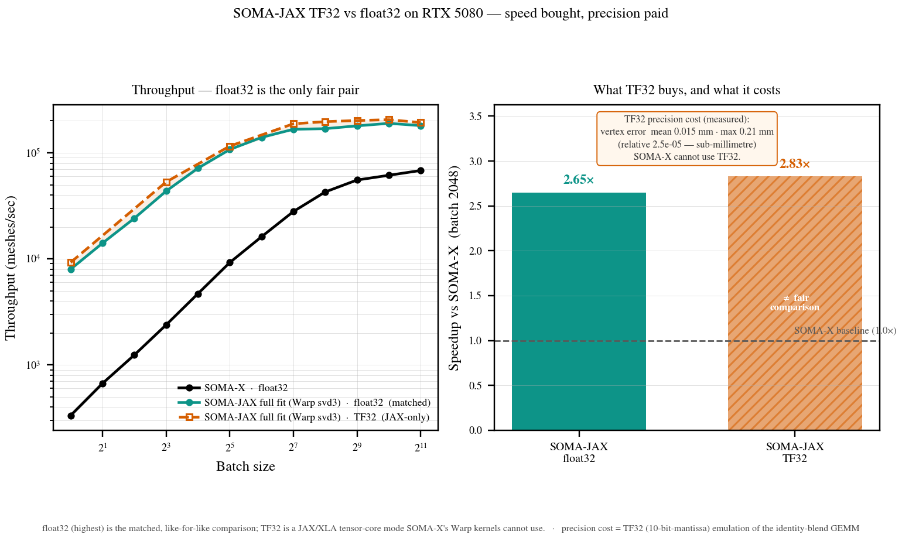
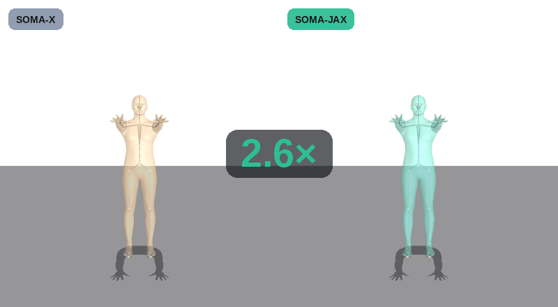
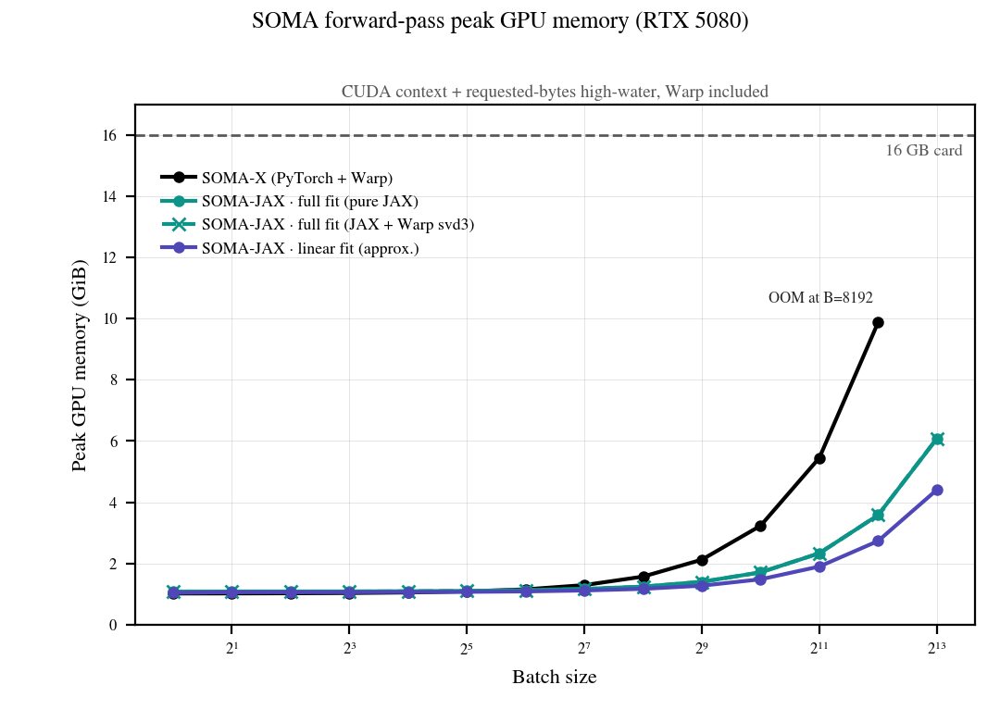
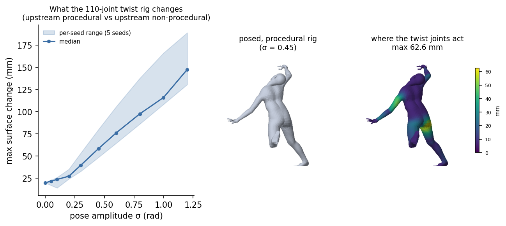

# SOMA-JAX vs SOMA-X — forward-pass benchmarks

Reproducing (and extending) the SOMA paper's **Table 4 (Runtime performance)**
([arXiv:2603.16858](https://arxiv.org/abs/2603.16858) — the paper is not
distributed with this repo) against SOMA-X v0.3.3 on a single NVIDIA
**RTX 5080 (16 GB)** in the `body` conda env. Two experiments:

* **Runtime** — forward-pass time & throughput vs batch size.
* **Memory** — peak GPU memory vs batch size.

Plus the checks that make them comparable, the TF32 trade-off, and a study of
what upstream's procedural rig changes.

## Folder layout

```
benchmarks/
  README.md
  _rig.py                                    # the public rig both sides skin
  bench_forward_pass.py   run_runtime.sh     plot_runtimes.py          # runtime
  bench_memory.py         run_memory.sh      plot_memory.py            # memory
  tf32_precision.py                          plot_tf32.py              # precision
  somax_reference.py      verify_fairness.py                           # fairness
                                             plot_procedural_gap.py    # rig study
  results/     runtime.json  runtime_tf32.json  memory.jsonl  tf32_precision.json
  figures/     runtimes.{png,pdf}  memory.{png,pdf}  tf32.{png,pdf}
               procedural_rig_gap.{png,pdf}
```

**Blackwell (RTX 50-series) needs CUDA >= 12.8.** JAX's `nvidia-*-cu12` wheels are
pinned only as `>=`, so an older environment can leave you on cuBLAS 12.4, which
carries no `sm_120` kernels; it fails with `INTERNAL: the library was not
initialized`, sometimes only for particular shapes. See
[`docs/INSTALL.md`](../docs/INSTALL.md) for the one-line fix. Verified working on
an RTX 5080 with the 12.9 wheels: all four pipelines benchmark.

Run:

```bash
# runtime (torch and JAX go in separate subprocesses — different CUDA stacks)
BATCHES="1 2 4 8 16 32 64 128 256 512 1024 2048" bash benchmarks/run_runtime.sh
python benchmarks/plot_runtimes.py

# fairness: SOMA-X's posed meshes first (a torch process), then the JAX checks
python benchmarks/somax_reference.py
python benchmarks/verify_fairness.py

# memory (one FRESH subprocess per (method, batch), on an otherwise idle GPU)
bash benchmarks/run_memory.sh
python benchmarks/plot_memory.py

# TF32 (JAX-only): see "Precision" below

# what upstream's 110-joint procedural rig changes (upstream vs upstream, CPU)
python benchmarks/plot_procedural_gap.py
```

## Numerical precision — one convention

**Every headline number on this page, runtime *and* memory, is true float32 on
both sides.** Storage is float32 throughout; the only variable is whether a
float32 *matmul* may run on TF32 tensor cores, and both benchmark scripts pin
that explicitly on both sides rather than inheriting library defaults:

| Side | Setting | Effect |
|---|---|---|
| SOMA-X (torch + Warp) | `torch.backends.cuda.matmul.allow_tf32 = False` | true float32 matmuls |
| SOMA-X (torch + Warp) | `torch.backends.cudnn.allow_tf32 = False` | no-op — cuDNN is unused by LBS/FK |
| SOMA-JAX (XLA) | `jax_default_matmul_precision = "highest"` | true float32 matmuls |

Leaving these implicit is a trap: JAX's `default_matmul_precision` is `None`,
which lets XLA pick **TF32** on Ampere and newer, while torch's `allow_tf32` is
already `False` — so the *unset* comparison is JAX-TF32 against
SOMA-X-float32, which flatters SOMA-JAX. Both scripts stamp the convention into
their output: a `precision` field on every backend in `runtime.json` and on
every row of `memory.jsonl`.

TF32 is measured **separately and never mixed into the float32 comparison** —
see [Precision — float32 is the fair headline](#tf32-section). The TF32 teaser's
"2.8×" is that JAX-only mode and is labelled as such; the like-for-like figure
for the same pipeline is the float32 "2.6×".

## The four setups

The three SOMA-JAX rows differ **only** in the per-identity *skeleton fit*
(mapping a body shape to its posed joints); all four share the same rig, the
same FK + top-8-sparse LBS, the same dimensions, and the same identity/pose
inputs.

| Setup | Skeleton fit | Framework |
|---|---|---|
| **SOMA-X (PyTorch + Warp)** | RBF joint regression + 2-stage Kabsch; rotation step = upstream's `auto` (Newton–Schulz on a gauge-regularized covariance, with a Kabsch SVD where that fails or the covariance is reflected) | torch + NVIDIA Warp kernels (the original) |
| **SOMA-JAX · full fit (pure JAX)** | *same algorithm* (`rotation_method="auto"`), JAX port | JAX / XLA |
| **SOMA-JAX · full fit (JAX + Warp svd3)** | same covariance build; the rotation step runs a Warp `svd3` kernel inside the JAX graph (XLA FFI) — plain Kabsch, see below | JAX + one Warp kernel |
| **SOMA-JAX · linear fit (approx.)** | approximate: a precomputed linear `J_regressor` (no rotation solve) | JAX / XLA |

**Both sides skin the same rig.** Since SOMA-X v0.3, `SOMA_neutral.npz` holds
shape and topology data only; the 78-joint public rig comes from
`SOMA_template_rig.usda`. The SOMA-X side builds
`SOMALayer(enable_procedural_transforms=False)`. The full-fit JAX pipelines read
the same rig through `soma_jax.rig_build.load_public_rig` ([`_rig.py`](_rig.py)),
and the linear row through the runtime archive built from it
(`tools/pipeline/build_soma_rig.py`). The comparison is therefore numerical as
well as computational: [`verify_fairness.py`](verify_fairness.py) checks the
timed pipelines against SOMA-X's own posed meshes.

**Pure JAX is the faithful row.** It runs upstream's rotation method and
reproduces SOMA-X's posed meshes to **0.0027 mm** (16 random identities, poses
and translations). The Warp `svd3` kernel implements plain Kabsch instead:
identical on well-conditioned covariances, different on ill-conditioned ones —
upstream's own Warp module ships a dedicated `auto` kernel that SOMA-JAX has not
ported. Its meshes differ from SOMA-X's by up to **0.69 mm** (mean 1.6 µm), so
the hybrid is a fast *approximation* of the pure-JAX row, not the same
algorithm. "Linear fit" is a cheaper approximation again.

<a name="fairness-audit"></a>
## Fairness audit

Every asymmetry found was fixed on the SOMA-JAX side; SOMA-X runs as published.

1. **Matmul precision** (was favouring JAX ~1.6×): XLA defaults float32 matmuls
   to TF32 on Ampere+, while SOMA-X runs full float32 (torch `allow_tf32=False`;
   Warp scalar kernels). Both sides now run full float32
   (`jax_default_matmul_precision="highest"`).
2. **Skel. scope**: SOMA-X's `prepare_identity` includes the identity blend +
   rebind precompute; the JAX mirror computes all four outputs.
3. **Output materialization**: the JAX forward returns the full `(B, V, 3)`
   vertex buffer (no scalar reduction XLA could fuse away).
4. **LBS sparsity**: both skin with top-8 sparse weights (`topk_skinning(W, 8)`;
   SOMA-X's Warp default is K=8).
5. **Same rig**: the JAX pipelines skin upstream's public rig (above). Earlier
   revisions timed them on the raw pre-v0.3 npz rig, which matched SOMA-X in
   shapes and FLOPs but not in values.
6. **Memory accounting**: SOMA-JAX is charged requested bytes, as torch's counter
   charges SOMA-X; SOMA-X's processes no longer carry an idle JAX backend; and
   SOMA-JAX no longer allocates a corrective network SOMA-X was told not to
   load. See [How memory is measured](#memory-methodology).

Cross-pipeline agreement, agreement with SOMA-X, no-constant-folding and
SVD non-uniqueness are checked by [`verify_fairness.py`](verify_fairness.py)
([results below](#fairness-verification); all assertions pass).

## Timing methodology (low variance)

The RTX 5080 idles at ~810 MHz and boosts to ~3090 MHz, and clocks can't be
locked without root — that ramp is the only real source of run-to-run spread.
`bench_forward_pass._timed_samples` handles it: a **wall-clock warmup** pins the
clocks at boost, then each sample times several forwards back-to-back with one
device sync (`inner`/`outer` self-size per batch), and the reported value is the
**median**. The uncertainty of that median is its standard error
(≈ 1.25·std/√n), which is **below 0.75% everywhere** — so the figures show
median lines with a hairline band, not fuzzy error envelopes. (The larger
per-call spread is GPU clock jitter — a property of a single call, not
measurement error.) Small batches are launch-bound and therefore sensitive to
host load: run on an otherwise idle machine.

## Paper Table 4 (excerpt — values verbatim, A100)

| Mode | Batch | Skel. (ms) | Total (ms) | Meshes/sec |
|---|---:|---:|---:|---:|
| Warp (GPU) | 1 | 0.8 | 2.1 | 476 |
| Warp (GPU) | 8 | 0.9 | 3.4 | 2 353 |
| Warp (GPU) | 32 | 1.1 | 6.8 | 4 706 |
| Warp (GPU) | 128 | 1.4 | 18.2 | 7 033 |
| PyTorch (CPU) | 1 | 3.2 | 12.1 | 83 |

## Runtime on RTX 5080 (median full forward, matched float32)

Milliseconds per forward, speedup over SOMA-X in brackets:

| Batch | SOMA-X | full fit, pure JAX | full fit, JAX + Warp svd3 | linear fit (approx.) |
|---:|---:|---:|---:|---:|
| 1 | 2.997 | 0.535 (5.60×) | 0.125 (23.96×) | 0.698 (4.29×) |
| 2 | 2.989 | 0.507 (5.90×) | 0.142 (21.01×) | 0.663 (4.51×) |
| 4 | 3.226 | 0.565 (5.71×) | 0.166 (19.46×) | 0.715 (4.51×) |
| 8 | 3.355 | 0.599 (5.60×) | 0.184 (18.26×) | 0.730 (4.60×) |
| 16 | 3.406 | 0.644 (5.29×) | 0.223 (15.25×) | 0.767 (4.44×) |
| 32 | 3.468 | 0.747 (4.65×) | 0.298 (11.64×) | 0.824 (4.21×) |
| 64 | 3.957 | 0.962 (4.11×) | 0.458 (8.64×) | 0.969 (4.08×) |
| 128 | 4.580 | 1.287 (3.56×) | 0.768 (5.97×) | 1.270 (3.61×) |
| 256 | 5.988 | 2.226 (2.69×) | 1.515 (3.95×) | 1.815 (3.30×) |
| 512 | 9.241 | 3.999 (2.31×) | 2.851 (3.24×) | 2.826 (3.27×) |
| 1024 | 16.678 | 7.512 (2.22×) | 5.402 (3.09×) | 5.051 (3.30×) |
| 2048 | 30.049 | 14.983 (2.01×) | 11.341 (2.65×) | 8.780 (3.42×) |

Throughput (meshes/sec):

| Batch | SOMA-X | full fit, pure JAX | full fit, JAX + Warp svd3 | linear fit (approx.) |
|---:|---:|---:|---:|---:|
| 1 | 334 | 1,868 | 7,993 | 1,432 |
| 8 | 2,384 | 13,347 | 43,535 | 10,956 |
| 32 | 9,227 | 42,865 | 107,366 | 38,833 |
| 128 | 27,945 | 99,457 | 166,716 | 100,814 |
| 256 | 42,754 | 115,029 | 168,967 | 141,051 |
| 512 | 55,403 | 128,037 | 179,584 | 181,146 |
| 1024 | 61,399 | 136,315 | 189,571 | 202,716 |
| 2048 | 68,156 | 136,686 | 180,578 | 233,248 |

Every batch, with standard errors and skeleton-fit-only timings, is in
[`results/runtime.json`](results/runtime.json).


([PDF](figures/runtimes.pdf))

### Runtime conclusions

* **The faithful pure-JAX pipeline is faster than SOMA-X at every batch:**
  5.6× at B=1, 3.6× at B=128, **2.0× at B=2048** (15.0 vs 30.0 ms; 137 k vs
  68 k meshes/sec). Earlier revisions of this page had it 1.65× *slower* at
  B=2048 (52.0 ms). The algorithm is the same, but its Kabsch fallback now gets
  real covariances only in the slots that use it: `jnp.where` evaluates the SVD
  for every joint, and every other slot now gets a diagonal placeholder that
  cuSOLVER's batched Jacobi SVD converges on at once — 2.6 ms instead of
  47.1 ms for the 159,744 covariances of B=2048.
* **The hybrid is faster still** — 24× at B=1, 6.0× at B=128, **2.65× at
  B=2048** (11.3 ms), peaking at 190 k meshes/sec (B=1024) — but it buys that
  with an optional dependency and the rotation-solve approximation above.
* **Small batches measure launch overhead.** SOMA-X costs ~3 ms per forward up
  to B≈32 whatever the batch (the fixed cost of its torch + Warp launches), so
  the small-batch ratios are sustained-throughput figures. The compute-bound
  comparison is B ≥ 1024: pure JAX 2.0–2.2×, the hybrid 2.65–3.1×.
* **The skinning path is never the bottleneck.** The linear approximation on
  the same FK + sparse-LBS machinery reaches **233 k meshes/sec** at B=2048
  (3.4×).

<a name="tf32-section"></a>
### Precision — float32 is the fair headline; TF32 is a JAX-only extra

Every table above is **matched full float32** (fairness point 1), which is the
*only* like-for-like comparison — because **SOMA-X cannot use TF32.** Its heavy
compute is Warp scalar-float32 kernels (FK, LBS, the Kabsch 3×3 SVD) plus a
*sparse* RBF matmul; none run on the TF32 tensor-core path. Turning on
`torch.backends.cuda.matmul.allow_tf32` does not speed SOMA-X up: its B=2048
forward measured 29.9 ms with it off and 30.1–30.3 ms with it on.

TF32 is a lever only the JAX/XLA side has, and on this pipeline a small one.
Measured JAX-only with `--matmul-precision default` (**not comparable to
SOMA-X's float32** — it is lower-precision arithmetic SOMA-X has no equivalent
for):


([PDF](figures/tf32.pdf))

<sub>Left: only the two **float32** curves are a like-for-like pair; the TF32
curve is set apart (JAX-only, lower precision). Right: the fair float32 speedup
(2.65×) vs the TF32 speedup (2.83×, flagged **not comparable**), with the
measured TF32 precision cost — mean **0.015 mm** / max **0.21 mm** vertex error
(relative ≈ 2.5e-5, sub-millimetre). SOMA-X cannot use TF32.</sub>

**SOMA-JAX · full fit (JAX + Warp svd3)**:

| Batch | float32 (m/s) | TF32 (m/s) | TF32 vs its own float32 |
|---:|---:|---:|---:|
| 1 | 7,993 | 9,256 | 1.16× |
| 8 | 43,535 | 53,086 | 1.22× |
| 128 | 166,716 | 187,827 | 1.13× |
| 512 | 179,584 | 201,712 | 1.12× |
| 1024 | 189,571 | 205,335 | 1.08× |
| 2048 | 180,578 | 193,001 | 1.07× |

The pure-JAX and linear rows gain 1.03–1.08× and 1.01–1.08×
([`results/runtime_tf32.json`](results/runtime_tf32.json)).

**Why so little.** TF32 accelerates dense matmuls, and the forward has two of
any size: the identity blend `(B, 128) @ (128, 3V)` and the skeleton fit's
covariance build `einsum('bva,vic->biac')`. Timed in isolation at B=2048 they
take 4.79 ms at float32 and 4.21 ms at TF32 — together 42% of the hybrid's
11.3 ms forward, sped up by only 12% — which accounts for the 0.73 ms the whole
forward saves. Everything else (FK, sparse LBS, the RBF regression, the rotation
solves) is gathers, elementwise work and batched 3×3 kernels.

**How to read it.** TF32 is a genuine but modest deployment speedup for
SOMA-JAX (1.07× at B=2048, up to 1.22× at small batch) at a **measured
sub-millimetre cost** — mean 0.015 mm / max 0.21 mm vertex error, relative
≈ 2.5e-5, from a 10-bit-mantissa emulation of the identity-blend GEMM, the
largest matmul in the forward ([`tf32_precision.py`](tf32_precision.py),
`results/tf32_precision.json`). It is a **precision trade-off, not a
like-for-like speed number**, so it is never put head-to-head with SOMA-X.
(For reference only, and *not a fair claim*: hybrid TF32 reads 2.83× against
SOMA-X's float32 at B=2048, vs the fair **2.65×**.)

Animated companion (`assets/media/soma_jax_tf32_teaser.gif`, via
`tools/compare_render/render_tf32_teaser.py`) — each column's panel is a progress
bar whose length reads the speedup, and the body switches float32 → TF32 in the
middle of the motion: the SOMA-JAX bar extends **2.6× → 2.8×** the SOMA-X bar
and its animation gets smoother while SOMA-X stays choppy (both ratios come from
`results/runtime.json` and `runtime_tf32.json` at B=2048, so the badge, this page
and the tables cannot drift apart):



Reproduce:

```bash
bash benchmarks/run_runtime.sh                              # float32 (fair, the headline)
# TF32, JAX-only (do not compare to SOMA-X):
python benchmarks/bench_forward_pass.py --skip-soma-x --matmul-precision default \
    --batches 1 8 32 128 256 512 1024 2048 \
    --output benchmarks/results/runtime_tf32.json
python benchmarks/tf32_precision.py                         # -> results/tf32_precision.json
python benchmarks/plot_tf32.py                              # -> figures/tf32.{png,pdf}
```

## Memory on RTX 5080 (peak GPU memory)

**One metric: `peak_mib`** — the CUDA context plus the high-water mark of the
**device bytes the process has requested**, with NVIDIA Warp's allocations
counted on both sides:

```
peak_mib = context_mib + max over time of (framework_requested + warp_requested)
```

Values in **GiB** (1 GiB = 1024 MiB). One fresh subprocess per point.

| Batch | SOMA-X | full fit (pure JAX) | full fit (JAX + Warp svd3) | linear fit |
|---:|---:|---:|---:|---:|
| 1 | **1.01** | 1.08 | 1.07 | 1.04 |
| 16 | **1.05** | 1.09 | 1.09 | 1.06 |
| 32 | 1.08 | 1.10 | 1.10 | **1.07** |
| 64 | 1.15 | 1.13 | 1.12 | **1.08** |
| 128 | 1.29 | 1.17 | 1.16 | **1.11** |
| 256 | 1.57 | 1.24 | 1.24 | **1.17** |
| 512 | 2.12 | 1.40 | 1.39 | **1.27** |
| 1024 | 3.23 | 1.71 | 1.71 | **1.48** |
| 2048 | 5.45 | 2.33 | 2.33 | **1.90** |
| 4096 | 9.88 | 3.58 | 3.58 | **2.73** |
| 8192 | **OOM** | 6.07 | 6.09 | **4.41** |

Every batch from 1 to 8192, with each total decomposed, is in
[`results/memory.jsonl`](results/memory.jsonl).

 ([PDF](figures/memory.pdf))

### Memory conclusions

* **SOMA-X starts lighter; SOMA-JAX grows far more slowly.** SOMA-X carries the
  smaller fixed baseline (1.01 vs 1.08 GiB at B=1, 64 MiB lighter than the
  full fit and 23 MiB lighter than the linear fit) and wins below the
  crossover, which the measured points bracket **between B=32 and B=64** for
  the full fit (at 32 SOMA-X is 18 MiB lighter, at 64 it is 26 MiB heavier)
  and between B=16 and B=32 for the linear fit. Above it
  SOMA-JAX pulls away — **2.3× lighter at B=2048, 2.8× at B=4096** (3.58 vs
  9.88 GiB) — and SOMA-X **OOMs at B=8192** on the 16 GB card (a 2.8 GiB Warp
  allocation fails) while every JAX pipeline still fits.
* **The difference at scale is marginal cost per sample.** Least-squares over
  B ≥ 1024: **2.215 MiB/sample** for SOMA-X against **0.624** for SOMA-JAX's
  full fit — **3.5× less** — and 0.418 for the linear fit. The output buffer
  alone (18,056 verts × 3 × float32) sets a 0.207 MiB/sample floor: SOMA-JAX's
  full fit sits at 3.0× it (the output plus about two `(B, V, 3)` temporaries),
  SOMA-X at 10.7×.
* **Why.** XLA does whole-graph buffer assignment — liveness analysis, fusion of
  elementwise chains, in-place reuse — so most LBS/FK temporaries are never
  materialised. Eager PyTorch allocates a fresh tensor per op and frees it only
  when its refcount drops, leaving many `(B, V, 3)` intermediates simultaneously
  live; SOMA-X's Warp kernels add their own `(B, V, 3)` buffers on top
  (1.43 GiB at B=2048, measured).
* **The two full-fit pipelines are memory-identical**: their requested bytes
  match to 0.2 MiB below B=8192 (the 2–4 MiB differences in the totals are the
  spread of the context reading) and differ by 12 MiB at it. The Warp `svd3` kernel receives XLA's buffers through
  the FFI and allocates nothing of its own — measured `warp_peak_mib = 0` for
  the hybrid row — so its speed costs no memory.
* **`linear` is the lightest JAX row, but not by much at small batch**: 41 MiB
  under full fit at B=1, then one `(B, V, 3)` temporary less per sample. It
  still carries the full `SkeletonTransfer` it never uses (488 MiB of RBF
  factors, [below](#memory-baseline)), because `SOMALayer.__init__` builds it,
  as upstream's constructor does.

<a name="memory-methodology"></a>
### How memory is measured (and why not nvidia-smi)

Nothing here polls. Every byte is counted where it is requested:

| Source | Counter | Character |
|---|---|---|
| XLA | resident: `jax.live_arrays()`; per execution: the temp and output buffers from `Compiled.memory_analysis()`, plus the loaded executable's generated code | exact — XLA's buffer assignment is static |
| PyTorch | `torch.cuda.memory_allocated()` / `max_memory_allocated()`, reset every iteration | exact requested bytes (512-byte rounding) |
| NVIDIA Warp | counting allocator installed via `wp.set_device_allocator` | exact, wraps and delegates to the allocator Warp was already using |
| CUDA context | one `cuMemGetInfo` read before model data loads | fixed, does not scale with batch; read device-wide, so the GPU must otherwise be idle |

**Why not XLA's own allocator counter.** `memory_stats()["bytes_in_use"]` counts
what XLA's BFC allocator has handed out, and BFC hands out a free chunk *whole*
when splitting it would leave less than the request (and under 128 MiB): six
fresh 66.7 MiB arrays — the size of the three largest RBF systems below, each
stored as `A` and its LU factor — occupy 578.7 MiB of `bytes_in_use` against
400.5 MiB requested. torch's caching allocator splits at ≤ 1 MiB granularity,
so its counter is effectively requested bytes. Reading XLA's would charge
SOMA-JAX 132 MiB of allocator slack that SOMA-X is never charged, while missing
the loaded executable altogether: XLA embeds the forward's closed-over model
constants in its generated code (49.6 MiB here), where neither counter sees it.
The harness charges that whole executable to SOMA-JAX — conservatively, since
SOMA-X's kernel code is not counted on its side — and still records the
allocator view in every JAX row (`xla_bytes_in_use_peak_mib`, 82–92 MiB above
the reported figure). Earlier revisions of this page used the allocator view.

**Warp is the part that makes SOMA-X's column honest.** SOMA-X runs with Warp's
memory pool disabled (`third_party/SOMA-X/soma/_warp_utils.py`), so its Warp
buffers come from plain `cudaMalloc` and are invisible to every `torch.cuda`
counter — and they scale with batch, reaching **1.43 GiB at B=2048** and
**2.87 GiB at B=4096**. Ignoring them would understate SOMA-X's slope as 1.52
instead of 2.215 MiB/sample. `bench_memory.py` therefore wraps Warp's allocator
with a counter that *delegates* to the allocator already in use: same mempool
setting, same underlying calls, no policy change — it only records sizes. This
is instrumentation, not modification; SOMA-X still runs exactly as published.

**Why not `nvidia-smi`.** It reports what a process has *reserved* from the
driver, not what it needs. Both frameworks pool, and their pools differ sharply
in granularity — torch's caching allocator uses fine 2 MiB blocks that track
demand closely, while XLA's BFC pool grows in large power-of-two blocks it never
releases. Reading reservation therefore charges SOMA-JAX for pool policy rather
than for memory it uses, and it has to be *sampled*, so it both jitters and can
miss short-lived peaks. (Disabling either pool was not an option — that would
stop measuring the pipeline a real user gets.) The one environment override is
`XLA_PYTHON_CLIENT_PREALLOCATE=false`: JAX's default grabs 75% of the card up
front, which the device-wide context read would then count as context.

**Combining two allocators.** `peak(a + b) ≠ peak(a) + peak(b)`, so the
combined high-water is sampled at every Warp alloc/free event (reading the
framework's requested-bytes counter at that instant), once per iteration, and
folded against the framework's own per-iteration peak so a torch/XLA-only
maximum can never be missed. Each row also carries `peak_upper_mib`, the
pessimistic `framework_peak + warp_peak` bound. The two agree to **≤ 0.91% on
SOMA-X and exactly on every JAX row**, so the reported figure is tightly
determined rather than an estimate.

**Process hygiene.** Each SOMA-X subprocess imports `soma_jax.assets` for its
default paths. Until this revision that import created a JAX array at module
level, which started an idle XLA backend inside the SOMA-X process and added
24 MiB to its context reading; no `soma_jax` import touches the GPU now. (The
runtime harness had the same import; re-timed without the backend, SOMA-X
reproduces `runtime.json` to 0.5% — 2.99 vs 3.00 ms at B=1, 29.9 vs 30.0 ms at
B=2048 — so the timings stand.) And
where no corrective checkpoint is loaded, SOMA-JAX's `SOMALayer` used to
allocate an untrained 387 MiB corrective network (SOMA-X allocates none, and
the benchmark builds SOMA-X with `correctives_model_path=None`); it now holds
`None`, as upstream does, which is what took the `linear` row from 1.42 to
1.04 GiB at B=1.

<a name="memory-baseline"></a>
### The fixed baseline, decomposed (B=1)

| Component | SOMA-X | SOMA-JAX (full fit) |
|---|---:|---:|
| CUDA context + framework runtime | 470 MiB | 434–438 MiB |
| Resident model data | 567 MiB | 593 MiB |
| — of which the per-joint RBF systems (`A` + LU) | 488 MiB | 488 MiB |
| Compiled executable (code + embedded constants) | not counted | 50 MiB |
| Per-call temporaries + output | 2 MiB | 22 MiB |
| **Total** | **1039 MiB** | **1098–1102 MiB** |

Both sides keep the per-joint RBF systems resident: upstream's
`SkeletonTransfer` retains its `RadialBasisFunction` objects — each holding the
system matrix `A` and its LU factorisation; the three largest systems are
4183 × 4183, 66.7 MiB per array — after building the sparse regression matrix
that inference actually uses, and SOMA-JAX mirrors those attributes. They are
44–47% of either baseline. The JAX context reading varies by ±2 MiB between
processes.

<a name="fairness-verification"></a>
## Fairness verification

[`verify_fairness.py`](verify_fairness.py) (run on a free GPU, after
`somax_reference.py`) confirms the timed JAX code does real, input-dependent
work and computes what SOMA-X computes — all assertions pass:

* **No constant-folding:** re-timing at B=64 with random non-zero inputs gives
  the same latency (pure JAX 0.961 vs 0.991 ms, ratio 1.03; hybrid 1.00) → the
  work is genuinely input-dependent.
* **Real output:** posed vertices finite, spatial std ≈ 0.42 m, change > 1 m
  with the input.
* **Same meshes as SOMA-X:** on 16 random identities, poses and translations,
  the pure-JAX pipeline matches SOMA-X's posed vertices to **0.0027 mm** max
  (0.29 µm mean); the hybrid to 0.69 mm max (1.6 µm mean).
* **Cross-pipeline agreement:** pure-JAX vs hybrid posed meshes agree to
  0.66 mm max / 2.9 µm mean at the benchmark operating point.
* **Same rotation solve as upstream:** on 4096 synthetic alignment problems
  (half near-planar), the pure-JAX port of upstream's `align_vectors` matches it
  to max|ΔR| = 8.1e-6 in float32 and 1.0e-13 in float64 (`auto` and `kabsch`;
  `newton-schulz` 1.2e-6 / 1.1e-15).
* **SVD non-uniqueness is not error:** against the algorithm the Warp kernel
  actually implements (`rotation_from_covariance(method="kabsch")`), 43 / 4096
  of those problems diverge, and there both answers are valid SO(3) with the
  same Kabsch residual (relative gap ≤ 1.4e-3). The pipelines' default `auto`
  diverges from the kernel on the same 43 (reported, not asserted). On the
  rig's ill-conditioned joint covariances `auto` and plain Kabsch genuinely
  differ, which is where the hybrid's 0.69 mm comes from — upstream SOMA-X's
  own `auto` and `kabsch` split the same way.

## The procedural rig — what upstream's twist joints change


([PDF](figures/procedural_rig_gap.pdf))

The benchmarks time the 78-joint rig on both sides
(`enable_procedural_transforms=False`). Upstream's default is the procedural
rig: 110 skinning joints, the 78 public ones plus 32 twist joints driven from
them. [`plot_procedural_gap.py`](plot_procedural_gap.py) measures what that
changes, **upstream against upstream** (not the port): SOMA-X's `SOMALayer` in
both modes, one neutral identity, poses `standard_normal((1, 77, 3)) * σ` over 5
seeds, CPU, no correctives. Maximum surface change, median over seeds (per-seed
range):

| σ (rad) | 0 | 0.1 | 0.2 | 0.45 | 0.8 | 1.2 |
|---|---:|---:|---:|---:|---:|---:|
| max change (mm) | 19.9 | 23.7 (14.1–26.0) | 27.3 (24.2–35.3) | 58.4 (48.5–80.0) | 97.7 (86.3–137.9) | 147.6 (130.7–189.1) |

The rigs differ already at σ = 0 (19.9 mm max, 0.78 mm mean): the zero pose is a
T-pose while the bind pose is an A-pose with the upper arms 51° below
horizontal, so both rigs swing the arms up and only the procedural one spreads
that swing over its twist joints. At σ = 0.45 the change concentrates on the
limbs (max 62.6 mm, mean 2.42 mm; right panel). SOMA-JAX ports the procedural
rig and makes it the default, as upstream does
([`docs/FAITHFULNESS.md`](../docs/FAITHFULNESS.md)).

## Caveats

* RTX 5080 vs the paper's A100 — absolute numbers aren't comparable across GPU
  generations; the within-GPU comparisons are.
* Both sides: correctives disabled (LBS-only), SOMA-native identity backend,
  the 78-joint public rig, matched full float32, `CUDA_VISIBLE_DEVICES=0`.
* Small-batch runtime is *sustained* throughput (host/launch overhead
  amortized), which is the right metric for a throughput benchmark but is not
  cold single-call latency.

## Files

| File | Purpose |
|---|---|
| `_rig.py` | upstream's public rig plus the core asset's shape data, for the JAX pipelines |
| `bench_forward_pass.py` | runtime benchmark (all 4 setups; median + SE; writes `results/runtime.json`) |
| `run_runtime.sh` | runs torch / JAX subprocesses and merges into `results/runtime.json` |
| `plot_runtimes.py` | two-panel runtime figure → `figures/runtimes.{png,pdf}` |
| `tf32_precision.py` | TF32 vertex-error emulation → `results/tf32_precision.json` |
| `plot_tf32.py` | TF32-vs-float32 trade figure (speed + measured precision cost) → `figures/tf32.{png,pdf}` |
| `somax_reference.py` | SOMA-X's posed meshes on seeded inputs → `results/_somax_reference.npz` (not committed) |
| `verify_fairness.py` | fairness checks (shared `_build_fair_pipeline`) |
| `bench_memory.py` | memory benchmark (context + requested-bytes high-water incl. Warp; one fresh subprocess per point) |
| `run_memory.sh` | memory sweep → `results/memory.jsonl` |
| `plot_memory.py` | single-panel memory figure (GiB) → `figures/memory.{png,pdf}` |
| `plot_procedural_gap.py` | upstream procedural vs legacy rig study → `figures/procedural_rig_gap.{png,pdf}` |
